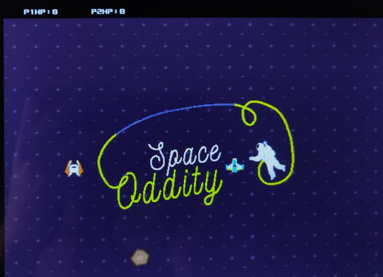

# FPGA双人空战——Space Oddity

灵感来自于https://howardlau.me/projects/flappga-mario-a-video-game-in-fpga.html

VGA框架、素材来自于https://timetoexplore.net/blog/arty-fpga-vga-verilog-01

由于这个项目上传的时候已经过去一年了，我也不知道它跑不跑得起来，而且原本有很多垃圾的图片和mem文件冗余，我也不知道哪些是有用的，哪些是没用的，那不如都上传一下。

**由于存在vivado跑不起来的可能性，所以我给了一个bit文件在/Game.runs中，可以直接烧写进FPGA使用。**

## 运行环境

vivado 2019.1

Diligent Nexys4 DDR4 FPGA

一个支持VGA的显示器

一个支持Nexys4的键盘（实验室大多数键盘都不支持）

## 思想介绍

### 图像引擎

鉴于FPGA强大的并行计算能力，本作品不使用一般游戏机中的往内存写入信息，再由VGA读出的方式来判断像素颜色，而是通过各个图层并行计算，得到该图层的透明和颜色信息，并直接传输到图像模块，再由图像模块通过优先译码器判断图层的重叠和颜色输出。

### 图层输出

图层输出中使用了电影中常用的”蓝幕“技术，把图像中应该为透明的部分全部填充上纯蓝色，在图像输出部分进行判断，从而得到图像的透明信息。

### 飞船控制

用户可通过FPGA上的按钮和开关来控制飞船移动，也可以通过键盘控制移动。由于每个飞船都是一个实体对象，只要输入相应的信号就能够移动，因此用户和系统均可以控制飞船，并且可以在两者之间随意切换。

## 游戏逻辑

### 按键逻辑

#### SW[0]作为操作方式的切换开关：

**当SW[0]为高电平时**：1P的操作由SW[3]\~SW[5],以及四个按钮BTNU,BTNL,BTND,BTNR完成，2P的操作由SW[6]\~SW[12]完成

**当SW[0]为低电平时**：1P的操作由**键盘**`W,A,S,D,Space,Q,E`完成，2P的操作由`I,J,K,L,P,U,O`完成

（注：引入SW[0]的主要原因时因为实验室键盘无法和开发板兼容，在找到合适键盘前对游戏的测试需要其他按键来代替，实属下下策）

#### SW[15]用于开始游戏

在`start page`界面中拨动SW[15]，游戏开始。

#### BTNC用于重新开始游戏

当游戏结束进入结算界面后，需要按动BTNC来使游戏重新回到`start page`

### start page

游戏初始界面如图所示：

在此界面玩家可以对游戏操作进行大致了解，在此界面的操作不会影响到血量`HP`的计算，但是可以使用所有的玩家按键，以体会游戏规则以及玩法。

拨动SW[15]以进入`initial page`，等待`initial page`动画结束后，游戏正式开始。

### initial page

在`start page`中拨动SW[15]，进入`initial page`，在该场景中，玩家控制被系统控制所接管，玩家无法对飞船做任何操作。

系统接管控制权后，将按照一定顺序，将玩家飞船从任意屏幕上的位置，恢复到游戏的开始状态，即游戏开始时，两架飞船的位置是固定的。然后状态机切到下一个状态，即`main page`，**游戏主界面的logo消失**。

（注1：游戏开始时飞船位置固定主要是考虑到游戏的公平性，因为在`start page`中，玩家可任意操控飞机飞到任意位置）

（注2：事实上也可以直接在一个时钟间隔内把飞船恢复到初始位置，但这样我认为过于突兀，需要一些动画效果控制）

### main page

本界面如图所示：

此时控制权重新从系统移交至玩家，两位玩家皆可以通过操作键盘上对应的按键来操作自己的飞船，攻击对方飞船（**游戏目的是攻击对方飞船，使之`HP`降为0，并保证双方飞船不同归于尽**）游戏界面顶部的生命值栏显示双方的`HP`值，当一方`HP`掉到0时，游戏结束，进入结算界面。

结算界面分为两种，分别分别为**一方胜利**的`final page 1`，和**双方同归于尽**的`final page 2`。

### final page 1

当游戏中一方`HP`降为0，但另一方不为0时，进入该结算界面。

此时控制权回到系统，玩家无法再操作飞船。

在该结算界面中，屏幕中大部分区域将会慢慢变黑，并最终将胜利者的飞船给框选出来，如图所示：

此时游戏已经结束，要新开始下一局游戏，需要按下BTNC按钮，回到`start page`。

### final page 2

当游戏中两方飞船撞在一起时，双方`HP`同时减小为0，进入该结算界面。

此时控制权回到系统，玩家无法再操作飞船。

在该结算界面中，屏幕中央会显示**perish together as fools**字样。表示对玩家同归于尽的嘲讽，如图所示：

此时游戏已经结束，要新开始下一局游戏，需要按下BTNC按钮，回到`start page`。
